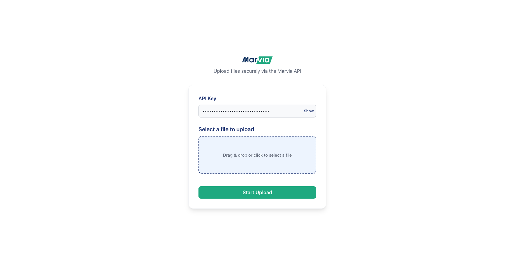

# MRB File Upload Client

This is a Next.js based client for uploading files using MRB multipart upload APIs.

**API Documentation:** [API Docs](https://api-v2.staging.getmarvia.com/docs/)



## Getting Started

1. **Install dependencies:**

   ```bash
   npm install
   ```

2. **Set environment variables:**

   - Copy `.env.example` to `.env.local`.
   - Fill in the required values for:
     - `NEXT_PUBLIC_API_URL`
     - `NEXT_PUBLIC_API_KEY`
   - Example:
     ```bash
     NEXT_PUBLIC_API_URL=https://your-api-url.com
     NEXT_PUBLIC_API_KEY=your-api-key
     ```

3. **Run the development server:**

   ```bash
   npm run dev
   ```

4. **Open the app:**
   Visit [http://localhost:3000](http://localhost:3000) in your browser.
